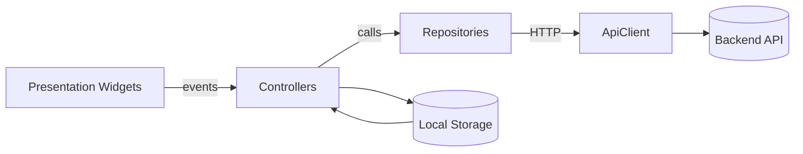
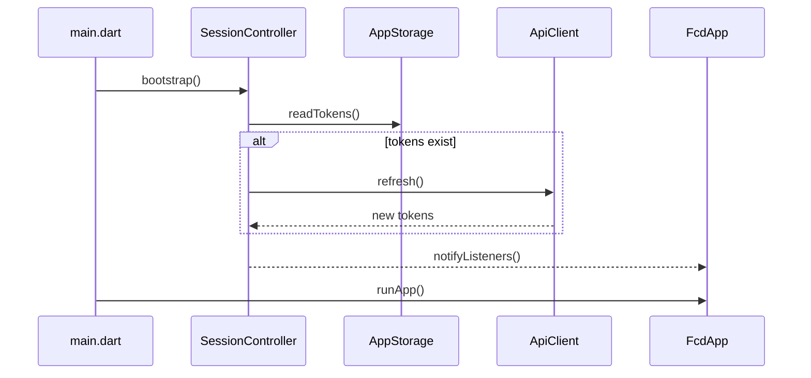
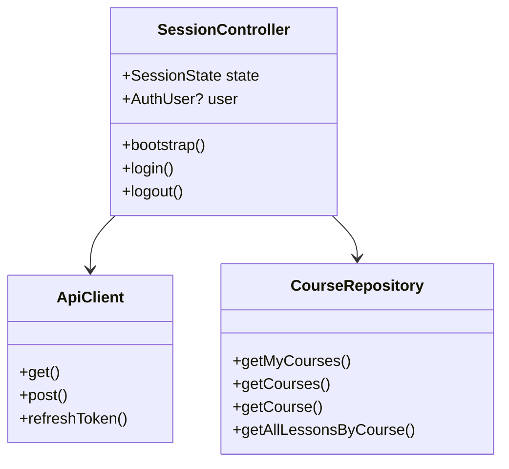

# FCD Flutter App — Master Class (Book-Style Guide)

> A deep, engineering-first guide to Flutter **and** how this codebase applies it in production.
>
> If you are new to Flutter, read from top to bottom. If you are onboarding to FCD, jump to the
> “Architecture” and “Feature Walkthrough” chapters and keep the Flutter fundamentals as reference.

---

## Table of Contents

1. **Why Flutter, and what problem this app solves**
2. **The Flutter mental model (widgets, elements, render objects)**
3. **Dart essentials for Flutter engineers**
4. **Project architecture in FCD**
5. **App startup and session bootstrap**
6. **Navigation and adaptive layout**
7. **State management and data flow**
8. **Networking, authentication, and error discipline**
9. **Persistence and local storage**
10. **Feature modules (courses, catalog, AI, downloads, favorites)**
11. **Media playback and file downloads**
12. **UI composition, layout rules, and theming**
13. **Testing philosophy and commands**
14. **Performance and reliability strategies**
15. **UML appendix (architecture, sequence, class diagrams)**

---

## 1) Why Flutter, and what problem this app solves

FCD is a **mobile-first learning platform**: users authenticate, browse courses, consume lessons
(video/audio/documents), track progress, save favorites, download content, and access AI assistance.

Flutter was chosen because it:

- **Unifies UI and logic across platforms** (Android/iOS) with a single codebase.
- Provides **predictable rendering** (Skia) and consistent UI across devices.
- Encourages **composable UI** that maps cleanly to product features.
- Has **fast iteration** (Hot Reload) which improves UI and feature velocity.

In other words: Flutter is not just “cross-platform UI”; it’s **a full application runtime** designed
for consistent behavior, performance, and maintainability.

---

## 2) The Flutter mental model (widgets, elements, render objects)

Flutter is built around three layers. Understanding them is the difference between “using Flutter”
and **engineering in Flutter**.

### 2.1 Widgets — Immutable configuration
A `Widget` is a **declarative configuration object**. It does not render itself. It describes what
*should* appear.

```dart
class CourseCard extends StatelessWidget {
  const CourseCard({super.key, required this.title});

  final String title;

  @override
  Widget build(BuildContext context) {
    return Card(
      child: Padding(
        padding: const EdgeInsets.all(16),
        child: Text(title, style: Theme.of(context).textTheme.titleMedium),
      ),
    );
  }
}
```

### 2.2 Elements — The live widget instances
An `Element` is the runtime “bridge” that stores widget state and participates in the tree.
When a widget rebuilds, Flutter **diffs widget types and keys** to decide which elements are reused.

**Why it matters:** If you keep widget identity stable, you keep its state stable.

### 2.3 Render objects — Layout and paint
Render objects do the heavy lifting: **layout** (constraints) and **paint** (pixels).
Widgets create elements, elements create render objects.

**Rule of thumb:** You write widgets. Flutter handles elements and render objects unless you’re
building custom layout primitives.

---

## 3) Dart essentials for Flutter engineers

### 3.1 Futures and async/await
Flutter UI runs on a single main isolate. **Non-blocking async** is mandatory.

```dart
Future<AuthSession> login(String email, String password) async {
  final response = await _apiClient.post('/login', data: {
    'email': email,
    'password': password,
  });
  return AuthSession.fromJson(response.data);
}
```

### 3.2 Streams (continuous data)
Use Streams for **progress, playback, and reactive updates**.

### 3.3 Null safety
All Dart code in this repo uses **sound null safety**. Avoid `!` unless you’re certain.

### 3.4 Immutability and data models
Keep models immutable. Parse defensively to handle backend drift.

---

## 4) Project architecture in FCD

FCD uses a **feature-first architecture** with a shared core.

```
lib/
  main.dart
  src/
    app.dart
    core/        // shared infrastructure (http, errors, config, storage, theme)
    state/       // global session state
    features/    // vertical modules (auth, courses, ai, downloads, etc.)
```

### Why this structure?
- **Clear boundaries**: feature code stays localized.
- **Reusable infrastructure** in `core`.
- **Minimal global state**: only the session is global.

---

## 5) App startup and session bootstrap

Startup is where most apps lose consistency. FCD makes it explicit:

1. Ensure Flutter bindings are ready.
2. Build the `SessionController`.
3. Bootstrap session (restore + refresh tokens).
4. Render the app only when state is stable.

### Key flow (simplified)

```dart
void main() async {
  WidgetsFlutterBinding.ensureInitialized();
  final sessionController = SessionController();
  await sessionController.bootstrap();

  runApp(
    ChangeNotifierProvider.value(
      value: sessionController,
      child: const FcdApp(),
    ),
  );
}
```

### Why this design?
- Prevents **login/home flicker** during session check.
- Centralizes token refresh logic.
- Guarantees UI only sees valid session states.

---

## 6) Navigation and adaptive layout

### 6.1 Gate-based routing
`app.dart` uses a Bootstrap Gate: it selects **Splash**, **Login**, or **Home** based on session state.
This avoids complex route guards and keeps startup deterministic.

### 6.2 Adaptive shell
`HomeShell` adapts to screen size:

- **Phone** → `NavigationBar` (bottom tabs)
- **Tablet** → `NavigationRail`

Why? To respect platform conventions and improve reachability.

---

## 7) State management and data flow

FCD uses **ChangeNotifier + Provider** for global session state, and **local state** within widgets.

### 7.1 Global session state
`SessionController` owns:

- current session state (`checking`, `authenticated`, `unauthenticated`)
- current user
- shared repositories

Why a single controller?

- It eliminates duplicated logic in screens.
- It centralizes token refresh and logout.
- It makes the authentication boundary explicit.

### 7.2 UI state vs app state
Keep **UI state** (e.g., text fields, toggles) inside widgets. Keep **app state** (auth, repositories)
in controllers.

---

## 8) Networking, authentication, and error discipline

### 8.1 API client and token refresh
`ApiClient` wraps Dio and handles:

- base URL and headers
- authentication tokens
- refresh flows on 401/403
- retrying original requests

```dart
final response = await _dio.get(
  '/courses',
  options: Options(headers: {'Authorization': 'Bearer $token'}),
);
```

### 8.2 Error strategy
UI never shows raw exceptions. Instead it maps them to human messages:

```dart
final message = userMessageFromError(error, fallbackMessage: 'Unable to load courses');
```

Why?
- Users want **actionable feedback**, not stack traces.
- It limits information leakage in production.

---

## 9) Persistence and local storage

Storage is separated by responsibility:

- `AppStorage` → auth/session tokens
- `FavoritesStorage` → per-user favorites
- Download history → `SharedPreferences`

Why this split?
- Testing becomes easier.
- Storage lifecycles are explicit.
- Minimizes cross-feature coupling.

---

## 10) Feature modules (courses, catalog, AI, downloads, favorites)

Each feature follows the same pattern:

1. **Models** (defensive parsing)
2. **Repository** (network IO)
3. **Presentation** (widgets)

### Example: Course repository

```dart
Future<List<CourseLesson>> getAllLessonsByCourse(String courseId) async {
  const maxLessons = 999; // avoid backend truncation
  final response = await _apiClient.get('/courses/$courseId/lessons', query: {
    'maxLessons': maxLessons,
  });
  return CourseLesson.listFromJson(response.data);
}
```

Why defensive parsing? Because real backends evolve. The app must be resilient.

---

## 11) Media playback and file downloads

`CoursePlayerPage` is the most complex screen. It manages:

- resource selection
- media lifecycle (video/audio)
- progress persistence
- lesson completion
- downloads

This is why changes must be **small and carefully tested**: media lifecycle bugs are subtle.

`DownloadRepository` uses Dio for resumable downloads and writes a local download history.

---

## 12) UI composition, layout rules, and theming

### 12.1 Constraints-based layout
Flutter layout follows **constraints down, sizes up, parents position children**.
If a widget overflows, **a parent constraint is missing**.

### 12.2 Theming
FCD centralizes theme in `core/theme`. This guarantees visual consistency and makes future
rebranding simple.

### 12.3 Composition over inheritance
Flutter encourages **small, reusable widgets** instead of large inheritance trees.

---

## 13) Testing philosophy and commands

The repo currently uses unit tests to validate:

- JSON parsing
- repository behavior
- error mapping
- download cleanup

Commands:

```bash
flutter analyze
flutter test --no-test-assets
```

Why tests here?
- Data and IO logic are the **highest-risk parts** of the system.
- UI behavior is easier to inspect manually during iteration.

---

## 14) Performance and reliability strategies

- Use `const` widgets where possible to reduce rebuild cost.
- Avoid rebuilding large subtrees for small changes.
- Dispose controllers (video, audio, animations) promptly.
- Prefer `IndexedStack` for tab shells to preserve state and avoid reloads.
- Separate IO from UI to keep rendering smooth.

---

## 15) UML appendix (architecture, sequence, class diagrams)

### 15.1 Architecture overview (component diagram)



### 15.2 Session bootstrap (sequence diagram)



### 15.3 Core domain classes (class diagram)



---

## Final note

Flutter is not “just UI”; it is a **full application runtime** with its own rendering engine,
async model, and architectural conventions. The FCD codebase applies those conventions to deliver
stable authentication, rich media playback, downloads, and AI-assisted learning — all while keeping
state explicit and errors humane.

If you are new to Flutter, focus on three truths:

1. **Everything is a widget** (immutable config).
2. **State lives in elements and controllers**, not in widgets themselves.
3. **The UI is a function of state** — clarity comes from where that state lives.

That is the foundation. Everything else is engineering discipline.
