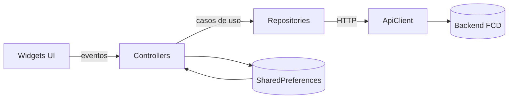
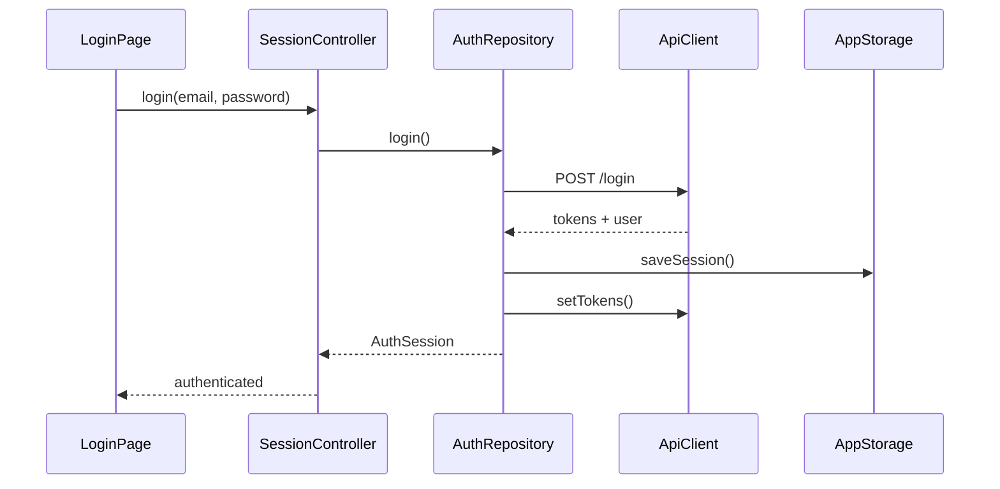
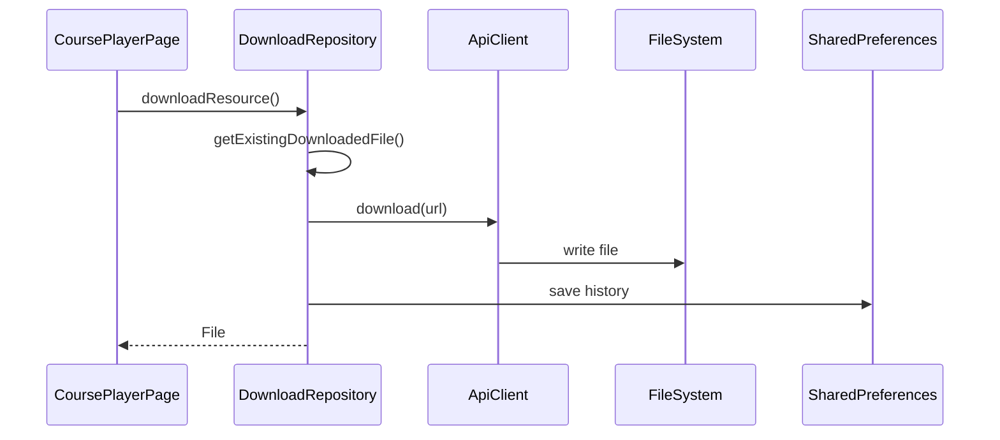
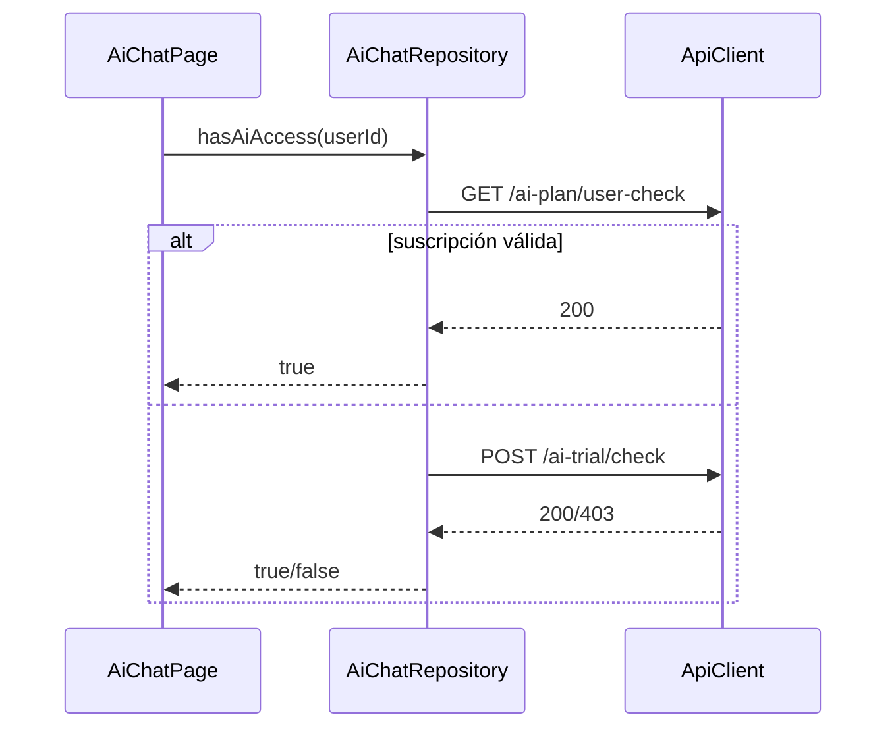

# FCD Flutter App — Master Class Exhaustiva (modo libro)

> **Propósito**: este documento es una guía **TOTAL y exhaustiva** del repositorio. Está escrito
> como un libro de onboarding para una persona ingeniera nueva en Flutter **y** nueva en este
> proyecto. Cada archivo del repo se explica con intención, razón de existir y relación con el resto.
>
> **Cobertura TOTAL**: todos los archivos del repo están listados y descritos en el índice de
> archivos y en las secciones de detalle.

---

## Cómo leer este libro

- Si eres nuevo en Flutter, **lee en orden** desde “Fundamentos” hasta “Repositorio”.
- Si ya dominas Flutter y solo quieres el mapa de código, ve directo a **“Mapa completo del repo”**.
- Si vas a tocar una feature, busca su sección y luego ve al **índice de archivos** para entender
  todas las piezas relacionadas.

---

# PARTE I — Fundamentos profundos de Flutter

## 1) Flutter como runtime, no solo UI

Flutter no es un “framework de UI”; es **un runtime completo**:

- Renderiza con su propio motor (Skia).
- Controla el árbol de widgets, el layout y la pintura.
- Maneja navegación, inputs, animaciones, gráficos y estado.

Esto significa que tu app es **un programa que pinta sus propios píxeles**. Por eso el diseño
es consistente entre Android e iOS y la arquitectura se centra en estado + UI declarativa.

---

## 2) Las tres capas fundamentales (Widget → Element → RenderObject)

### 2.1 Widget (configuración inmutable)
Un widget es **configuración declarativa**. No vive en memoria como “estado”; describe qué debería
existir en pantalla.

```dart
class CourseTitle extends StatelessWidget {
  const CourseTitle({super.key, required this.title});
  final String title;

  @override
  Widget build(BuildContext context) {
    return Text(title, style: Theme.of(context).textTheme.titleMedium);
  }
}
```

### 2.2 Element (instancia viva)
Los elementos viven en el árbol runtime. Flutter reutiliza elementos si:

- el tipo de widget es el mismo
- la key coincide

**Esto es crítico**: si cambias keys o tipos, Flutter destruye y crea nuevo estado.

### 2.3 RenderObject (layout y pintura)
Los render objects hacen el trabajo pesado: medir y pintar. Flutter gestiona esto por ti, excepto
si escribes widgets de layout personalizados.

---

## 3) Ciclo de vida y reconstrucciones

### 3.1 StatelessWidget
Se reconstruye cuando su padre se reconstruye. No guarda estado interno.

### 3.2 StatefulWidget + State
- `initState()` se ejecuta una sola vez.
- `setState()` dispara un rebuild.
- `dispose()` libera recursos (controllers, streams, listeners).

**En FCD** esto se ve claramente en `CoursePlayerPage`, donde se liberan controladores
multimedia y tokens de descarga.

---

## 4) Sistema de layout: “constraints go down, sizes go up”

Regla de oro:

1. El padre impone constraints (mínimos/máximos).
2. El hijo elige tamaño dentro de esas constraints.
3. El padre posiciona al hijo.

Cuando aparece un “overflow” casi siempre falta una constraint adecuada arriba.

---

## 5) State management en Flutter

Flutter no impone una arquitectura única. En este repo se usa:

- **ChangeNotifier + Provider** para estado global.
- Estado local en widgets para UI efímera.

La clave es separar **estado de aplicación** (sesión, repositorios) de **estado visual** (inputs,
loading flags, selección local).

---

## 6) Asincronía: Futures y Streams

Flutter corre en un solo isolate principal. Toda operación de red o IO debe ser async.

```dart
Future<void> loadCourses() async {
  final data = await repository.getCourses();
  setState(() => _courses = data);
}
```

Los `Stream`s se usan donde el estado cambia continuamente (reproducción de audio, progreso, etc.).

---

## 7) Navegación y rutas en Flutter (cómo se usa aquí)

Flutter usa `Navigator` y `MaterialPageRoute`. En este repo:

- El **gate inicial** decide si mostrar login o home.
- Las transiciones de cursos usan `Navigator.push`.
- `CourseSummaryPage` usa `pushReplacement` para mantener flujo lineal.

---

# PARTE II — Dart esencial para este repo

## 8) Null safety
Todo el repo está en null-safety estricto. El patrón más común es:

- **`?`** para valores opcionales
- **`late`** para inicialización diferida
- **`!`** solo cuando se garantiza no-null

## 9) Inmutabilidad y parseo defensivo
Los modelos del backend se parsean con helpers (`json_utils.dart`) que toleran claves alternativas
y tipos inconsistentes. Esto **reduce fragilidad frente a APIs reales**.

---

# PARTE III — Dependencias (por qué están aquí)

El `pubspec.yaml` define las librerías clave:

- `dio`: HTTP client robusto (timeouts, interceptors, downloads).
- `provider`: inyección y estado global.
- `shared_preferences`: persistencia liviana local.
- `better_player_plus`: reproducción de video avanzada + caché.
- `just_audio`: reproducción de audio con streams de estado.
- `webview_flutter`: visualización de documentos (Google Docs Viewer).
- `path_provider`: rutas seguras por plataforma.
- `open_filex`: abrir archivos locales descargados.
- `google_fonts` / `intl` / `url_launcher`: tipografía, formato de fechas y enlaces externos.

---

# PARTE IV — Arquitectura general de FCD

## 10) Diseño general (visión de componentes)



**Principio**: UI solo habla con controladores/repositorios. Nunca con el backend directo.

---

## 11) Mapa de carpetas principal

```
lib/
  main.dart
  src/
    app.dart
    core/
    state/
    features/
```

- `core`: infraestructura y utilidades compartidas.
- `state`: sesión global.
- `features`: módulos funcionales (auth, courses, ai, etc.).

---

# PARTE V — Bootstrap y sesión global (con detalle)

## 12) main.dart — arranque real

**Qué hace**:
1. Inicializa bindings.
2. Crea `SessionController`.
3. Ejecuta `bootstrap()`.
4. Monta `Provider` y `FcdApp`.

```dart
void main() async {
  WidgetsFlutterBinding.ensureInitialized();
  final sessionController = SessionController();
  await sessionController.bootstrap();
  runApp(ChangeNotifierProvider.value(
    value: sessionController,
    child: const FcdApp(),
  ));
}
```

**Por qué**: evita que el usuario vea UI inconsistente mientras se restaura sesión.

---

## 13) app.dart — Bootstrap Gate

**Responsabilidad**: decidir qué pantalla mostrar (Splash/Login/Home).

- `_splashFinished` se activa tras 2200ms.
- `SessionController` define si está autenticado.
- `AnimatedSwitcher` suaviza transiciones.

---

## 14) session_controller.dart — sesión global TOTAL

Campos clave:

- `_status`: estado (checking/unauthenticated/authenticated)
- `_user`: usuario
- `_errorMessage`: error visible en login
- `_apiClient`: cliente HTTP con callbacks
- `courseRepository`, `aiChatRepository`: repos compartidos

Métodos:

- `bootstrap()`: restaura sesión desde storage.
- `login()`: autentica y aplica sesión.
- `logout()`: limpia storage y estado.
- `_handleUnauthorized()`: fuerza logout si refresh falla.
- `_handleTokenRefreshed()`: persiste nuevos tokens.

---

# PARTE VI — CORE (infraestructura base)

## 15) ApiConfig

- `defaultBaseUrl`: endpoint productivo.
- `baseUrl`: configurable vía `--dart-define=FCD_API_BASE_URL`.
- `googleViewerUrlPrefix`: prefijo para documentos.

## 16) ApiClient — HTTP y refresh

Capas internas:

- `Dio` con baseUrl, timeouts y headers.
- Interceptor: si 401/403 → intenta refresh.
- `_refreshingFuture`: evita refresh duplicados.
- `_retry()` reintenta request original con token nuevo.

Métodos públicos:

- `get/post/put/delete`: JSON estándar.
- `postWithHeaders`: usado para refresh.
- `download`: descarga binaria.

## 17) AppException + error_ui

- `AppException`: mensaje + statusCode.
- `userMessageFromError`: transforma errores a texto humano.

## 18) Storage

- `AppStorage`: guarda tokens + user metadata.
- `FavoritesStorage`: set de IDs por usuario (JSON en SharedPreferences).
- `ProgressStorage`: lessonIndex/resourceIndex/position.

## 19) Theme

`AppTheme.light()` define colores, tipografías, inputs y botones.

## 20) Utils

`json_utils.dart` permite parseo tolerante a estructuras inconsistentes del backend.

## 21) Widgets comunes

`NetworkImageTile` carga imagen remota o muestra fallback.

---

# PARTE VII — Features con explicación TOTAL

## 22) Auth (login y refresh)

### Archivos
- `auth_user.dart`: parsea admin vs user con múltiples claves.
- `auth_session.dart`: user + tokens.
- `auth_repository.dart`: login, refresh, logout.
- `login_page.dart`: UI y validaciones.

### Detalles clave

- `AuthUser.fromLoginResponse` y `.fromRefreshResponse` manejan dos formatos distintos.
- `AuthRepository.login` valida statusCode y tokens.
- `AuthRepository.restoreSession` evita sesiones inválidas y limpia storage si falla.

---

## 23) HomeShell (navegación principal)

- 6 tabs: Cursos, Catálogo, IA, Favoritos, Descargas, Cuenta.
- `IndexedStack` preserva estado de cada tab.
- `NavigationRail` en tablet (shortestSide >= 600).

---

## 24) Courses (núcleo productivo)

### Modelos

- `Course`: id, nombre, precios, categoryName derivado.
- `CourseLesson`: recursos + evaluación.
- `LessonResource`: tipo (audio/video/document) + orden.

### Repository

- `getMyCourses` y `getCourses` retornan listas parseadas.
- `getAllLessonsByCourse` usa `allLessonsRequestLimit=999`.
- `markLessonAsCompleted` actualiza progreso.

### UI

**CoursesPage**
- Búsqueda local.
- Agrupación por categoría.
- Carga de temario al entrar.

**CourseSummaryPage**
- Resume progreso con `ProgressStorage`.
- Ofrece “Continuar” o “Empezar desde el principio”.

**CoursePlayerPage**

- Mantiene `_lessonIndex` y `_resourceIndex`.
- Guarda progreso y posición multimedia.
- Maneja video (BetterPlayer), audio (just_audio) y documentos (WebView).
- Descarga recursos con `DownloadRepository`.
- Favoritos con `FavoritesStorage`.

Detalles críticos:

- `_resourcePreparationRequestId` evita carreras entre recursos.
- `_activeMediaResourceKey` asegura que el progreso se guarde para el recurso correcto.
- `_saveProgressOnDispose` hace best-effort en `dispose()`.

---

## 25) Catalog

`CatalogPage` replica la experiencia de cursos pero sobre el catálogo completo:

- Agrupación por categoría.
- Búsqueda local.
- `RefreshIndicator`.

---

## 26) AI

**Repository**

- `getPrompts()` filtra categorías válidas.
- `getChatMessages()` selecciona chat por título.
- `saveChatMessage()` persiste mensajes.
- `askAi()` llama `/chatAI/chatBot`.
- `hasAiAccess()` usa plan o trial.

**UI**

- Tabs de categorías.
- Carga de prompts y mensajes.
- Envío de mensajes y actualización del historial.

---

## 27) Favorites

- `FavoritesStorage` guarda IDs por usuario.
- `FavoritesPage` reconstruye el contexto completo
  (curso + lecciones) para cada favorito.

---

## 28) Downloads

- `DownloadRepository` descarga, guarda historial y limpia faltantes.
- `DownloadsPage` muestra historial y permite abrir archivos.

---

## 29) Account

- Muestra datos del usuario.
- Verifica acceso a IA.
- Logout.

---

## 30) Splash

Animación de entrada con `AnimationController` y logo.

---

# PARTE VIII — Diagramas UML (flujos clave)

## 31) Login y bootstrap



## 32) Descarga de recurso



## 33) Acceso a IA



---

# PARTE IX — Mapa completo del repo (archivo por archivo)

> Esta sección cubre **TODOS** los archivos en el repositorio.

## 34) Raíz del repo

- `README.md`: documentación operativa, comandos y arquitectura resumida.
- `pubspec.yaml`: dependencias, assets y configuración Flutter.
- `analysis_options.yaml`: lints y reglas de análisis.
- `devtools_options.yaml`: configuración de DevTools.
- `.metadata`: metadata de Flutter (proyecto).
- `.gitignore`: exclusión de artefactos.
- `LICENSE`: licencia del proyecto.
- `fcd_app.iml`: metadata de IDE (JetBrains).

## 35) .github

- `.github/workflows/copilot-setup-steps.yml`: workflow para preparar Flutter en CI.

## 36) docs

- `docs/fcd_flutter_code_walkthrough.md`: este libro.
- `docs/fcd_flutter_code_walkthrough.pdf`: versión PDF sincronizada.

## 37) assets

- `assets/images/logo.jpg` / `.png` / `.ico`: logo principal usado en Splash y launcher icon.

## 38) lib (código productivo)

### 38.1 Entradas y estado

- `lib/main.dart`: bootstrap + Provider raíz.
- `lib/src/app.dart`: MaterialApp + BootstrapGate.
- `lib/src/state/session_controller.dart`: estado de sesión + repositorios.

### 38.2 Core

- `lib/src/core/config/api_config.dart`: baseUrl + Google Viewer prefix.
- `lib/src/core/errors/app_exception.dart`: excepción de negocio.
- `lib/src/core/errors/error_ui.dart`: map de errores a mensajes.
- `lib/src/core/http/api_client.dart`: Dio wrapper + refresh logic.
- `lib/src/core/storage/app_storage.dart`: persistencia de tokens y usuario.
- `lib/src/core/storage/favorites_storage.dart`: favoritos por usuario.
- `lib/src/core/storage/progress_storage.dart`: progreso de cursos.
- `lib/src/core/theme/app_theme.dart`: tema y tipografías.
- `lib/src/core/utils/json_utils.dart`: parseo defensivo.
- `lib/src/core/widgets/network_image_tile.dart`: imagen de red con fallback.

### 38.3 Features

**Account**
- `lib/src/features/account/presentation/account_page.dart`: UI de cuenta y logout.

**AI**
- `lib/src/features/ai/data/models/chat_message.dart`: modelo de mensaje.
- `lib/src/features/ai/data/repositories/ai_chat_repository.dart`: API AI.
- `lib/src/features/ai/presentation/ai_chat_page.dart`: UI chat.

**Auth**
- `lib/src/features/auth/data/models/auth_session.dart`: modelo sesión.
- `lib/src/features/auth/data/models/auth_user.dart`: parseo user/admin.
- `lib/src/features/auth/data/repositories/auth_repository.dart`: login/refresh/logout.
- `lib/src/features/auth/presentation/login_page.dart`: pantalla login.

**Catalog**
- `lib/src/features/catalog/presentation/catalog_page.dart`: catálogo completo.

**Courses**
- `lib/src/features/courses/data/models/course.dart`: modelo Course + categorías.
- `lib/src/features/courses/data/models/course_lesson.dart`: lecciones + recursos.
- `lib/src/features/courses/data/models/lesson_resource.dart`: recurso individual.
- `lib/src/features/courses/data/repositories/course_repository.dart`: endpoints cursos.
- `lib/src/features/courses/presentation/courses_page.dart`: lista de cursos del usuario.
- `lib/src/features/courses/presentation/course_summary_page.dart`: resumen y temario.
- `lib/src/features/courses/presentation/course_player_page.dart`: reproducción y progreso.

**Downloads**
- `lib/src/features/downloads/data/models/downloaded_file.dart`: modelo historial.
- `lib/src/features/downloads/data/repositories/download_repository.dart`: descargas.
- `lib/src/features/downloads/presentation/downloads_page.dart`: UI historial.

**Favorites**
- `lib/src/features/favorites/presentation/favorites_page.dart`: UI favoritos.

**Home**
- `lib/src/features/home/presentation/home_shell.dart`: shell de navegación.

**Splash**
- `lib/src/features/splash/presentation/splash_page.dart`: splash animado.

## 39) tests (cobertura total)

- `test/widget_test.dart`: prueba de parseo Course básica.
- `test/src/core/errors/error_ui_test.dart`: errores → mensajes.
- `test/src/core/utils/json_utils_test.dart`: parseo defensivo.
- `test/src/test_helpers/fake_api_client.dart`: API fake para repositorios.
- `test/src/features/ai/data/repositories/ai_chat_repository_test.dart`: AI repo.
- `test/src/features/courses/data/models/course_lesson_test.dart`: orden de recursos.
- `test/src/features/courses/data/models/course_test.dart`: parseo Course.
- `test/src/features/courses/data/repositories/course_repository_test.dart`: endpoints.
- `test/src/features/downloads/data/repositories/download_repository_test.dart`: descargas.

## 40) android (plataforma)

- `android/app/src/main/AndroidManifest.xml`: manifest principal.
- `android/app/src/debug/AndroidManifest.xml`: overrides debug.
- `android/app/src/profile/AndroidManifest.xml`: overrides profile.
- `android/app/src/main/kotlin/.../MainActivity.kt`: entry point nativo.
- `android/app/build.gradle.kts`: config módulo app.
- `android/build.gradle.kts`: config proyecto.
- `android/gradle.properties`: flags de Gradle.
- `android/settings.gradle.kts`: inclusión de módulos.
- `android/gradle/wrapper/gradle-wrapper.properties`: versión Gradle.
- `android/app/src/main/res/**`: iconos y launch background.
- `android/app/src/main/java/.../GeneratedPluginRegistrant.java`: registro plugins.
- `android/local.properties`: rutas locales (generado).

## 41) ios (plataforma)

- `ios/Runner/AppDelegate.swift`: entry point iOS.
- `ios/Runner/SceneDelegate.swift`: scene lifecycle.
- `ios/Runner/Info.plist`: config iOS.
- `ios/Runner/Base.lproj/*.storyboard`: launch + main storyboards.
- `ios/Runner/Assets.xcassets/**`: iconos y splash.
- `ios/Runner.xcodeproj/*`: configuración Xcode.
- `ios/Runner.xcworkspace/*`: workspace.
- `ios/Flutter/*.xcconfig`: configuración de build.
- `ios/Podfile`: dependencias CocoaPods.
- `ios/RunnerTests/RunnerTests.swift`: tests nativos.

---

# PARTE X — Conclusión

Este repo no es grande en número de archivos, pero **sí es completo** en funcionalidad:

- autenticación real
- cursos y multimedia
- descargas y persistencia local
- IA con control de acceso
- UX adaptativa

Este documento cubre **todo** lo existente en el repositorio. Si agregas un archivo nuevo,
la regla del proyecto es simple: **documentarlo aquí**.
